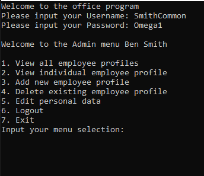
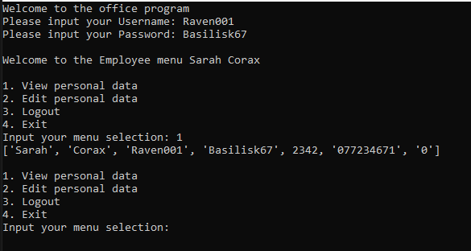

# T-Level_CodingRepository

Welcome to my portfolio, this will look at the python projects that i have created this year:

## Mastermind
Code for my mastermind game:
```python
import random

### FUNCTIONS AREA ###

def CodeMakerGenerator():
    FirstDig = str(random.randint(0,9))
    SecondDig = str(random.randint(0,9))
    ThirdDig = str(random.randint(0,9))
    FourthDig = str(random.randint(0,9))
    FinalCode = FirstDig + SecondDig + ThirdDig + FourthDig
    return FinalCode

def Game(CodeMakerCode, UserGuess):
    CorrectNumbers = 0
    CorrectPosition = 0
    for i in range(len(UserGuess)):
        if CodeMakerCode[i] == UserGuess[i]:
            CorrectPosition += 1
        if CodeMakerCode[i] in UserGuess:
            CorrectNumbers += 1
    return CorrectNumbers, CorrectPosition

def UserReplayResponse():
    replay = True
    while replay == True:
        strUserInput = input("Would you like to play again [Y/N]: ")
        if strUserInput.upper() == "Y":
            replay == False
            ReturnedValue = 1
            break
        elif strUserInput.upper() == "N":
            print("Goodbye")
            replay = False
            ReturnedValue = 0
            break
        else:
            print("Incorrect please input either [Y/N]")
    return ReturnedValue

### MAIN AREA ###
play = True
intCorrectNumbers = 0
intCorrectPosition = 0
strUserGuess = 0

print("Welcome to Mastermind have fun!!!")

while play == True:
    Guesses = 0
    try:
        if UserResponse == 1:
            pass
        elif UserResponse == 0:
            break
    except:
        UserResponse = 1
    Code = CodeMakerGenerator()
    while Code != strUserGuess:
        strUserGuess = input("Guess the 4 digit code the Code Master has created: ")
        if strUserGuess.isdigit() == True and len(strUserGuess) == 4:
            intCorrectNumbers, intCorrectPosition = Game(Code, strUserGuess)
        else:
            continue
        if intCorrectPosition == 4:
            print("Well done you guessed the correct code")
            UserResponse = UserReplayResponse()
            if UserResponse == 1:
                continue
            elif UserResponse == 0:
                break
        else:
            print("You had", intCorrectNumbers,"Correct Numbers and", intCorrectPosition,"numbers in the correct position.")
            Guesses += 1
            if Guesses == 10:
                print("You have ran out of guesses\nThe code was",Code)
                UserResponse = UserReplayResponse()
                if UserResponse == 1:
                    continue
                elif UserResponse == 0:
                    break
```
### Output


## User Management System
Code for a user management system within python:
```python
import random
### EMPLOYEE INFO ###

arrEmployeeInfo = [["Ben","Smith","SmithCommon","Omega1",123213,"077330234","1"] , ["Jacob","Thorson","JThor","Alpha2",12314325,"077234235","1"] , ["Chris","Hilde","HideChris","Theta45",12523,"077235243","1"] , ["Greg","Rover","TheRover","Epsilon32",2354352,"077125452","0"] , ["James","Divan","Jay.Div","Beta21",12312,"076435234","0"] , ["Alice","Livion","LadyAlice","Serria98",325346,"072354363","0"] , ["Megan","Khan","TheKhan","Hydra88",6856,"072357543","0"] , ["Candice","Johnson","MisJohnson","Dragon23",53456,"077213264","0"] , ["Sarah","Corax","Raven001","Basilisk67",2342,"077234671","0"]]

### FUNCTION AREA ###
def ViewAllEmployeeInfo():
    for employee in arrEmployeeInfo:
                print(employee)

def IndividualEmployeeSearch():
    Search = True
    while Search == True:
        AdminUserSearch = input("Enter the employee ID for the profile: ")
        for intCounter in range(len(arrEmployeeInfo)):
            if int(AdminUserSearch) == arrEmployeeInfo[intCounter][4]:
                print(arrEmployeeInfo[intCounter])
                Search = False

def AddNewEmployee():
    PassCorrect = False
    IDchecked = False
    AccessSelected = False
    
    NewEmployeeFirstName = input("Enter new employees first name: ")
    NewEmployeeLastName = input("Enter new employees last name: ")
    NewEmployeeUsername = input("Enter new employees username: ")
    
    while PassCorrect == False:
        SpecialCharacters = ["$", "@", "#", "%", "!", "*", "?"]
        NewEmployeePassword = input("Password must be longer than 6 characters include 1 number, special character, upper and lowercase characters\nEnter new employee password: ")
        if len(NewEmployeePassword) < 6:
            print("Password should be longer than 6 characters")
        if not any(char.isupper() for char in NewEmployeePassword):
            print('Password should have at least one uppercase letter')
        if not any(char.islower() for char in NewEmployeePassword):
            print('Password should have at least one lowercase letter')
        if not any(char.isdigit() for char in NewEmployeePassword):
            print('Password should have at least one number')
        if not any(char in SpecialCharacters for char in NewEmployeePassword):
            print('Password should have at least one of the symbols\n',SpecialCharacters)
        else:
            PassCorrect = True
    
    while IDchecked == False:
        NewEmployeeID = random.randrange(1000, 99999999)
        for intCounter in range(len(arrEmployeeInfo)):
            if NewEmployeeID == arrEmployeeInfo[intCounter][4]:
                IDchecked = False
            else:
                IDchecked = True

    NewEmployeeNumber = input("Enter new employees phone number: ")
    
    while AccessSelected == False:
        NewEmployeeAccess = input("What level of access does this new employee have(Admin/Employee): ")
        if NewEmployeeAccess.lower() == "admin":
            NewEmployeeAccess = 1
            AccessSelected = True
        elif NewEmployeeAccess.lower() == "employee":
            NewEmployeeAccess = 0
            AccessSelected = True
        else:
            print("Invalid input please enter 'Admin' or 'Employee'")

    NewEmployeeInfo = [NewEmployeeFirstName,NewEmployeeLastName,NewEmployeeUsername,NewEmployeePassword,NewEmployeeID,NewEmployeeNumber,NewEmployeeAccess]
    arrEmployeeInfo.append(NewEmployeeInfo)
    return

def DeleteEmployee(AdminID):
    EmployeeConfirmed = False

    for employee in arrEmployeeInfo:
                print(employee)
    while EmployeeConfirmed == False:
        AdminUserDelete = input("Enter the employeeID of the employee data you would like to delete: ")
        for intCounter in range(len(arrEmployeeInfo)):
            if int(AdminUserDelete) == arrEmployeeInfo[intCounter][4] and int(AdminUserDelete) != AdminID:
                print(arrEmployeeInfo[intCounter])
                AdminConfirmation = input("Do you confirm you want to delete this profile(Y/N): ")
                if AdminConfirmation.lower() == "y":
                    arrEmployeeInfo.remove(arrEmployeeInfo[intCounter])
                    EmployeeConfirmed = True
                    return
                elif AdminConfirmation.lower() == "n":
                    EmployeeConfirmed = True
                    return
        print("Invalid employee ID or current account ID entered")
        return
                

def EditAdminData(AdminID):
    Search = True
    while Search == True:
        for intCounter in range(len(arrEmployeeInfo)):
            if AdminID == arrEmployeeInfo[intCounter][4]:
                print(arrEmployeeInfo[intCounter])
                EmployeePosition = intCounter
                Search = False
    PersonalDataSelection = input("\n1. Firstname\n2. Lastname\n3. Username\n4. Password\n5. Number\n6. Return back to main menu\nSelect what info would you like to change: ")
    if PersonalDataSelection == "1":
        NewFirstname = input("What would you like to change your 'Firstname' to: ")
        arrEmployeeInfo[EmployeePosition][0] = NewFirstname
        print(arrEmployeeInfo[EmployeePosition])
    elif PersonalDataSelection == "2":
        NewLastname = input("What would you like to change your 'Lastname' to: ")
        arrEmployeeInfo[EmployeePosition][1] = NewLastname
        print(arrEmployeeInfo[EmployeePosition])
    elif PersonalDataSelection == "3":
        NewUsername = input("What would you like to change your 'Lastname' to: ")
        arrEmployeeInfo[EmployeePosition][2] = NewUsername
        print(arrEmployeeInfo[EmployeePosition])
    elif PersonalDataSelection == "4":
        PassCorrect = False
        while PassCorrect == False:
            SpecialCharacters = ["$", "@", "#", "%", "!", "*", "?"]
            NewPassword = input("Password must be longer than 6 characters include 1 number, special character, upper and lowercase characters\nEnter new password: ")
            if len(NewPassword) < 6:
                print("Password should be longer than 6 characters")
            if not any(char.isupper() for char in NewPassword):
                print("Password should have at least one uppercase letter")
            if not any(char.islower() for char in NewPassword):
                print("Password should have at least one lowercase letter")
            if not any(char.isdigit() for char in NewPassword):
                print("Password should have at least one number")
            if not any(char in SpecialCharacters for char in NewPassword):
                print("Password should have at least one of the symbols\n",SpecialCharacters)
            else:
                arrEmployeeInfo[EmployeePosition][3] = NewPassword
                print(arrEmployeeInfo[EmployeePosition])
                PassCorrect = True
                return
    elif PersonalDataSelection == "5":
        NewPhoneNumber = input("What would you like to change your 'Phone Number' to: ")
        arrEmployeeInfo[EmployeePosition][5] = NewPhoneNumber
        print(arrEmployeeInfo[EmployeePosition])
    elif PersonalDataSelection == "6":
        pass
    else:
        print("Invalid option selected please select options (1-6)")

def AdminMenu(AdminFirstName, AdminSecondName,AdminID):
    print("\nWelcome to the Admin menu",AdminFirstName,AdminSecondName)
    Menu = True
    while Menu == True:
        UserMenuSelection = input("\n1. View all employee profiles\n2. View individual employee profile\n3. Add new employee profile\n4. Delete existing employee profile\n5. Edit personal data\n6. Logout\n7. Exit\nInput your menu selection: ")
        if UserMenuSelection == "1":
            ViewAllEmployeeInfo()
        elif UserMenuSelection == "2":
            IndividualEmployeeSearch()
        elif UserMenuSelection == "3":
            AddNewEmployee()
        elif UserMenuSelection == "4":
            DeleteEmployee(AdminID)
        elif UserMenuSelection == "5":
            EditAdminData(AdminID)
        elif UserMenuSelection == "6":
            print("Logging out...")
            print("Welcome to the office program")
            Login()
        elif UserMenuSelection == "7":
            Menu = False
            exit()
        else:
            print("Invalid selection choose between (1-7)")

def ViewPersonalData(EmployeeID):
    Search = True
    while Search == True:
        for intCounter in range(len(arrEmployeeInfo)):
            if EmployeeID == arrEmployeeInfo[intCounter][4]:
                print(arrEmployeeInfo[intCounter])
                Search = False

def EditEmployeeData(EmployeeID):
    Search = True
    while Search == True:
        for intCounter in range(len(arrEmployeeInfo)):
            if EmployeeID == arrEmployeeInfo[intCounter][4]:
                print(arrEmployeeInfo[intCounter])
                EmployeePosition = intCounter
                Search = False
    PersonalDataSelection = input("\n1. Firstname\n2. Lastname\n3. Username\n4. Password\n5. Number\n6. Return back to main menu\nSelect what info would you like to change: ")
    if PersonalDataSelection == "1":
        NewFirstname = input("What would you like to change your 'Firstname' to: ")
        arrEmployeeInfo[EmployeePosition][0] = NewFirstname
    elif PersonalDataSelection == "2":
        NewLastname = input("What would you like to change your 'Lastname' to: ")
        arrEmployeeInfo[EmployeePosition][1] = NewLastname
    elif PersonalDataSelection == "3":
        NewUsername = input("What would you like to change your 'Lastname' to: ")
        arrEmployeeInfo[EmployeePosition][2] = NewUsername
    elif PersonalDataSelection == "4":
        PassCorrect = False
        while PassCorrect == False:
            SpecialCharacters = ["$", "@", "#", "%", "!", "*", "?"]
            NewPassword = input("Password must be longer than 6 characters include 1 number, special character, upper and lowercase characters\nEnter new password: ")
            if len(NewPassword) < 6:
                print("Password should be longer than 6 characters")
            if not any(char.isupper() for char in NewPassword):
                print("Password should have at least one uppercase letter")
            if not any(char.islower() for char in NewPassword):
                print("Password should have at least one lowercase letter")
            if not any(char.isdigit() for char in NewPassword):
                print("Password should have at least one number")
            if not any(char in SpecialCharacters for char in NewPassword):
                print("Password should have at least one of the symbols\n",SpecialCharacters)
            else:
                arrEmployeeInfo[EmployeePosition][3] = NewPassword
                PassCorrect = True
                return
    elif PersonalDataSelection == "5":
        NewPhoneNumber = input("What would you like to change your 'Phone Number' to: ")
        arrEmployeeInfo[EmployeePosition][5] = NewPhoneNumber
    elif PersonalDataSelection == "6":
        pass
    else:
        print("Invalid option selected please select options (1-6)")

def EmployeeMenu(EmployeeFirstName, EmployeeSecondName,EmployeeID):
    print("\nWelcome to the Employee menu",EmployeeFirstName,EmployeeSecondName)
    Menu = True
    while Menu == True:
        UserMenuSelection = input("\n1. View personal data\n2. Edit personal data\n3. Logout\n4. Exit\nInput your menu selection: ")
        if UserMenuSelection == "1":
            ViewPersonalData(EmployeeID)  
        elif UserMenuSelection == "2":
            EditEmployeeData(EmployeeID)
        elif UserMenuSelection == "3":
            print("Logging out...")
            print("Welcome to the office program")
            Login()
        elif UserMenuSelection == "4":
            Menu = False
            exit()
        else:
            print("Invalid selection choose between (1-4)")

def Login():
    LoginPassed = False
    while LoginPassed == False:
        strUserUsername = input("Please input your Username: ")
        strUserPassword = input("Please input your Password: ")
        for intCounter in range(len(arrEmployeeInfo)):
            if strUserUsername == arrEmployeeInfo[intCounter][2] and strUserPassword == arrEmployeeInfo[intCounter][3]:
                if arrEmployeeInfo[intCounter][6] == "0":
                    EmployeeFirstName = arrEmployeeInfo[intCounter][0]
                    EmployeeSecondName = arrEmployeeInfo[intCounter][1]
                    EmployeeID = arrEmployeeInfo[intCounter][4]
                    EmployeeMenu(EmployeeFirstName, EmployeeSecondName,EmployeeID)
                    LoginPassed = True
                    return
                if arrEmployeeInfo[intCounter][6] == "1":
                    AdminFirstName = arrEmployeeInfo[intCounter][0]
                    AdminSecondName = arrEmployeeInfo[intCounter][1]
                    AdminID = arrEmployeeInfo[intCounter][4]
                    AdminMenu(AdminFirstName, AdminSecondName,AdminID)
                    LoginPassed = True
                    return
        print("Username or password was incorrect please check capitilisation")
    return

### MAIN AREA ###           

print("Welcome to the office program")
Login()
```

### Output


